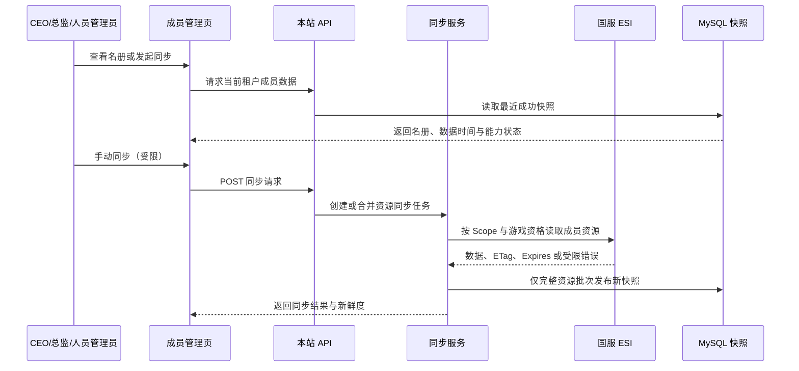

# 军团人员模块：功能详细设计

> 状态：讨论稿 v0.1（2026-09-08）  
> 依赖：国服接口数据调研见 [02-interface-data-research.md](02-interface-data-research.md)。

## 1. 业务流程

## 2. 页面设计

### 2.1 成员名册

页面路径：`/eve/members`。顶部显示军团名称、基础名册/追踪/头衔/角色历史四项数据状态、上次成功时间和“同步”按钮。同步按钮仅对 `eve:members:manage` 可见，且根据资源冷却状态禁用。

列表列：角色名、本站账号关联、游戏头衔、关键游戏职位、本站业务角色、在团状态、入团时间、最近登录、最近登出、位置、舰船、基地、最近同步时间。拥有 `eve:members:track:view` 的用户直接显示追踪列；没有该权限时隐藏这些列并展示权限说明。

筛选：角色名 / ID、在团状态、本站账号是否关联、游戏头衔、游戏职位、本站业务角色、标签、数据异常。排序仅对已落库字段生效。

空状态必须区分：尚未同步、无成员、授权缺少基础 Scope、上游暂不可用、无本站查看权限。不能统一显示“暂无数据”。

### 2.2 成员详情抽屉

分为四个区块：

1. **身份概览**：角色 ID、角色名、公开资料、当前在团状态、本站账号关联（仅显示本站昵称，不显示凭据）。
2. **游戏权限与头衔**：按全局 / 总部 / 基地 / 其他地点展示角色；展示头衔及其名称；标注快照时间。
3. **本站运营资料**：标签、内部备注、负责人。编辑权限为 `eve:members:manage`；每次修改写审计。
4. **运营追踪**：入团、最近登录/登出、位置、舰船、基地。拥有 `eve:members:track:view` 的用户可直接查看，非总监也可以被授予该权限；无权限或上游未提供时说明原因。

### 2.3 角色变更历史与同步记录

角色变更历史按 `changed_at` 倒序，显示变更对象、发起人、角色范围、新旧角色差异和来源批次。同步记录按资源显示开始/结束时间、状态、记录数、响应缓存时间、失败分类和重试次数；不显示 access token、refresh token、回调 code 或原始敏感响应。

## 3. 本站 API 设计

所有 API 从当前登录会话解析租户；禁止由浏览器指定或切换 `corporation_id`。所有 ID 按前端既有约定以字符串返回。

| 方法与路径 | 权限 | 请求 / 返回要点 | 说明 |
| --- | --- | --- | --- |
| `GET /eve/members` | `eve:members:view`；追踪列二次校验 | `page`、`size`、筛选条件；返回列表、分页、四类资源新鲜度 | 拥有追踪查看权限时一并返回追踪列；否则服务端完全剔除这些字段 |
| `GET /eve/members/{characterId}` | `eve:members:view` | 返回身份、头衔、游戏角色、本站角色、标签/备注 | 服务端校验成员属于当前租户 |
| `GET /eve/members/{characterId}/tracking` | `eve:members:track:view` | 返回追踪字段、来源时间、字段可用性 | 非总监可获授权；缺数据返回可解释状态，不以空对象代替 |
| `GET /eve/members/{characterId}/role-history` | `eve:members:view` | 分页返回角色变更历史 | 历史数据不存在时返回空页与资源状态 |
| `PUT /eve/members/{characterId}/operations-profile` | `eve:members:manage` | 标签 ID、备注、负责人 | 只更新本站表，写操作审计 |
| `POST /eve/members/sync` | `eve:members:manage` | 可选 `resources`；返回任务 ID / 合并结果 | 仅允许基础名册、追踪、头衔、角色历史四类白名单资源 |
| `GET /eve/members/sync-runs` | `eve:members:manage` | 资源、状态、时间范围分页 | 仅当前租户审计 |

## 4. 权限、隐私与审计

1. 数据源资格和本站展示资格缺一不可。即使 CEO 授权可拉取追踪数据，普通本站成员仍看不到。
2. 每次读取追踪数据记录查看审计：操作者、成员角色 ID、字段组、时间、请求 ID；不记录具体位置与舰船内容。
3. 角色名、职位、头衔、位置等不允许被全文搜索引擎或跨租户缓存泄露。
4. 内部备注仅在当前租户加条件更新，更新使用乐观锁或版本号，避免管理员互相覆盖。
5. 未绑定本站账号的游戏成员仍可展示；本站账号关联仅基于 `server + character_id` 的明确绑定。

## 5. 同步状态机与异常提示

| 状态 | 含义 | 页面行为 |
| --- | --- | --- |
| `NEVER_SYNCED` | 从未成功同步 | 显示引导与所缺数据源资格 |
| `RUNNING` | 同步正在执行 | 展示进度和旧快照，不清空列表 |
| `SUCCESS` | 完整批次已发布 | 展示数据时间、上游过期时间 |
| `PARTIAL_FAILURE` | 非关键资源失败 | 保留基础名册，标识对应追踪列或详情区为旧数据/不可用 |
| `AUTHORIZATION_REQUIRED` | Scope、令牌或游戏资格不足 | 显示具体资源与重新授权 / 更换数据源指引 |
| `UPSTREAM_UNAVAILABLE` | 限流、网络或服务错误 | 保留旧快照，展示可重试时间 |

## 6. 测试验收

- 两个租户各有同名或不同名角色时，接口和列表绝不串数据。
- 名册同步中断、超时、分页/名称解析失败时，不批量把旧成员标记离团。
- 缺少追踪 Scope 时，基础名册仍可用，追踪区给出准确原因。
- 获授权的非总监可读取追踪 API 和成员列表追踪列；未获追踪权限的查看者不能读取这些字段、备注、同步审计或触发同步。
- 游戏职位按四范围保存和展示；历史角色差异在重复同步时幂等。
- 人员管理员编辑标签/备注后可追溯操作人和前后值；游戏侧无任何写请求。
