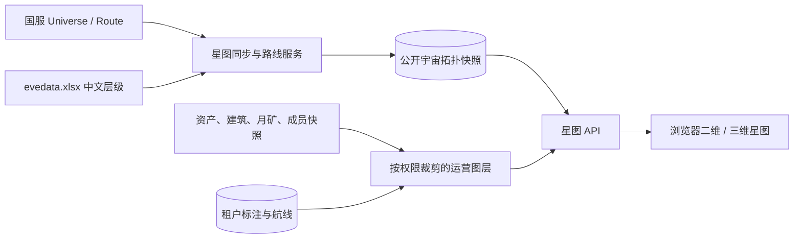

# 星图与导航：功能详细设计

## 数据流与权限边界

公开拓扑与租户运营数据绝不混表。`星图 API` 先校验本站权限，再拼接允许展示的图层；成员位置、资产数量和月矿时间线不会因为客户端勾选图层而绕过权限。

## 页面设计

“军团星图”采用主画布 + 右侧详情抽屉，默认画布为二维“军团足迹”。顶部提供全局名称搜索、视图切换（军团足迹 / 星域 / 星座 / 全宇宙 / 三维探索）、安全等级筛选、图层开关、定位和全屏。画布缩放时自动聚合节点：全宇宙显示星域与活跃区域，放大后显示星座、星系和星门连线；名称仅在可读密度下出现。

可选图层为：军团建筑、资产、月矿、成员追踪、运营标注和当前路线。自动图层使用统一图标和数量徽标；运营标注使用与类别对应的颜色和图标。没有相应权限的图层不显示开关，且接口不返回其计数。

点击星系打开详情抽屉：中文名称、星域/星座、安全等级、星门数量、最近地图资料时间，以及当前用户可见的建筑、资产摘要、月矿时间线、成员最后记录和标注。抽屉内可创建标注、作为路线起点/终点、进入位置资料页；不显示内部 ID。

“航线库”显示当前军团保存的路线。路线详情展示起终点、经由点、官方计算的跳数、路线资料时间与覆盖状态；地图上以高亮连线和编号节点显示。重新计算必须由用户明确触发，完成后才替换当前路线并记录重新验证时间。

## 核心交互

### 搜索、定位与路线

搜索支持中文、英文和部分名称匹配，结果展示星域 → 星座 → 星系层级。选择结果会定位并打开详情。路线编辑器采用“起点、可选经由点、终点”形式：每一段调用官方 Route 接口，服务端拼接并去重连续星系；不可达或上游失败不能保存为“已验证路线”。

### 运营标注

标注必须从已选星系或搜索结果创建，字段为类别、标题、说明、颜色、到期时间。标题最长 80 字、说明最长 1,000 字；到期后默认从地图隐藏但可在标注管理中恢复。修改、归档和恢复记录本站操作审计。自动生成的建筑、月矿、资产与成员标记是只读图层，避免把事实数据与人工判断混淆。

## 服务端接口契约

| 接口 | 用途 | 关键规则 |
| --- | --- | --- |
| `GET /eve/starmap/coverage` | 底图同步状态 | 返回节点/边覆盖率、最近成功和失败摘要 |
| `GET /eve/starmap/graph` | 获取当前视图底图与允许图层 | 按 `view`、层级和图层参数裁剪；全图使用聚合节点，禁止返回无界明细 |
| `GET /eve/starmap/systems/suggest` | 全局名称搜索 | 最多 20 条，名称和层级脱敏展示 |
| `GET /eve/starmap/systems/{systemId}` | 星系详情 | 所有业务摘要在服务端完成权限裁剪 |
| `POST /eve/starmap/routes/preview` | 预览官方路线 | 校验星系存在、逐段调用 Route、返回跳数和序列 |
| `/eve/starmap/routes` | 保存、查询、归档军团路线 | 读写均以 `tenant_id` 隔离 |
| `/eve/starmap/annotations` | 维护运营标注 | 只接收星系、类别及受限文本字段 |

## 容错与可观测性

- 图谱索引未完成时，地图可显示已完整解析的区域；顶部显示“宇宙资料已覆盖 x%”，不得把未同步区域显示为没有星门。
- 自动图层沿用原业务模块的数据新鲜度；失败时保留最后成功快照并在详情中显示数据时间与失败状态。
- 图形渲染使用 Canvas/WebGL，节点标签与图标按缩放级别虚拟化；全宇宙视图只下发聚合摘要，区域视图才下发星系和边。
- 三维探索使用同一拓扑及 X/Y/Z 坐标，载入失败自动退回二维，不影响路线、标注或业务数据。

## 实现依赖顺序

先完成静态拓扑表、续跑同步和覆盖率接口，再交付二维画布、搜索和星系详情；在此基础上接入各业务图层、运营标注和路线库。三维探索仅复用已验证的静态图谱与权限裁剪接口，不建立第二套数据来源。
